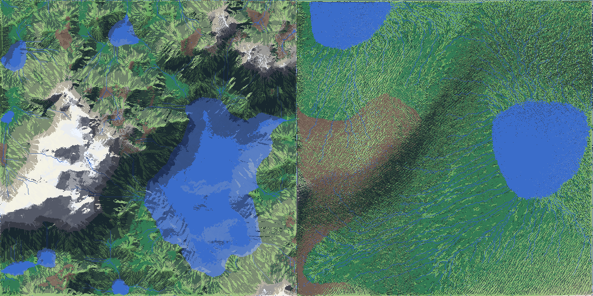
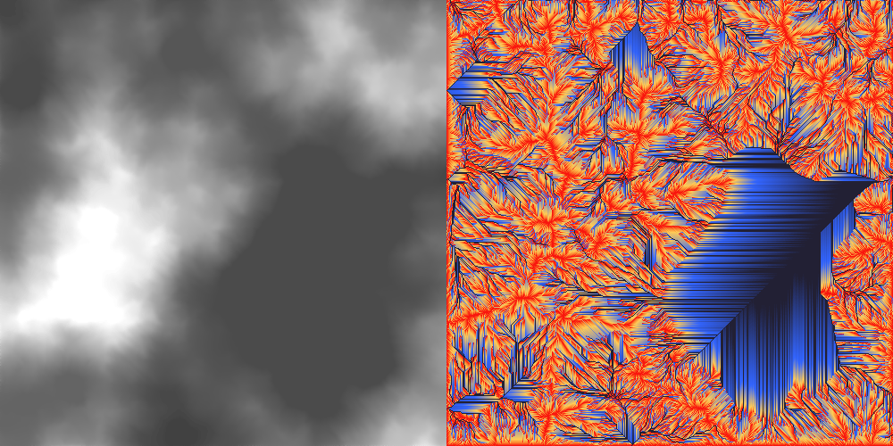
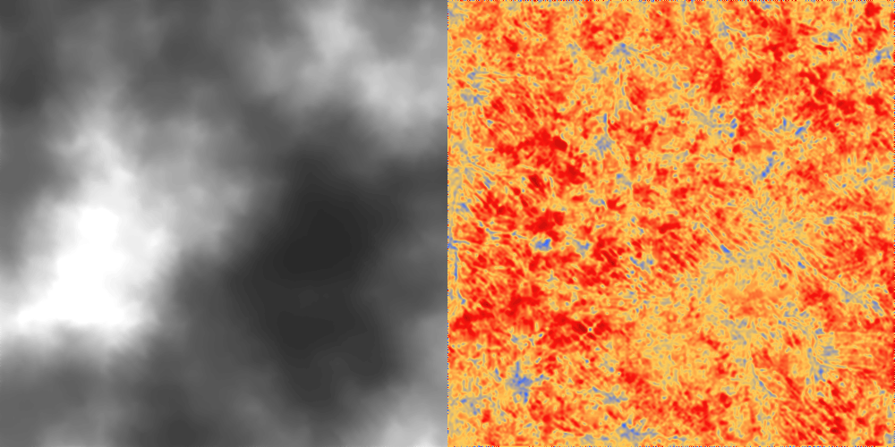

# SLTerrainGeneration

SLTerrainGeneration is a mini C++ library for generating and analyzing terrain. Inlcuding
properly flowing rivers and lakes with erosion and deposition simulation. It contains two major
classes, `SLHydrology` and `SLTerrain`, along with a number of helper classes and an example program.

Standard library only. No external dependencies.

`SLHydrology` contains from sctach implementations of geospatial hydrological
analysis methods to simulate water flow, erosion and deposition on heightmaps, along with
methods for generating basic geospatial data from heightmaps (slope + aspect) and for filling sinks.

`SLTerrain` uses `SLHydrology` to simulate water flow and erosion on a heightmap
generated using fractal brownian motion. And because I made this library with a 4x game in mind
it also simulates wildfires (cellular automata style) and has a basic terrain and resource categorization.

The example program demonstrates how to use the library to generate terrain, analyze it, and
simulate water flow and erosion. The example program outputs to bmp a heightmap, a flow accumulation
map, an erosion and deposition map, and a terrain map (using aspect and slope to create highlights and shadows).
Most of the model parameters are adjustable in the example program's config.ini.

Author: Michael Tuck, acellular.itch.io, 2024.
MIT LICENCE


Example output from the same seed (59339) with a terrain `age`
(controlling the number of erosion iterations) of 250 on the left and 10000 on the right.


## Using SLTerrain

This class uses the geospatial hydrology methods from `SLHydrology` along with standard game dev techniques
like fractional brownian motion (FBM, otherwise known as layered Perlin noise) to generate terrain.

To generate terrain simply using the default parameters:
```cpp
#include "SLTerrain.h"

SLTerrain terrain;
terrain.newMap(); // sets up the terrain and runs the erosion model for the default age (300)
```
`SLTerrain` will generate a heightmap, run the erosion model for with the default
250 years and categorize the terrain into grassland, forest, valley, mountain, plateau and glacier. categories.

Pass parameters into the generator using the `FBMParams` (fractal brownian motion with frequency,
lacunarity, octaves etc.), `TerrainParams` (sizing, age) and `ErosionParams` structs.

The `age` parameter is the most imporant, since it controls the number of iterations
the erosion model runs to create the terrain. The `useChannelErosion` parameter controls
the use of my own (rather hacky) extra channel erosion method for building up river valleys,
which can sometimes help reduce artifacts from the base erosion model in `SLHydrology`.

Setup with custom parameters as found in example program:
```cpp
// set parameters
SLTerrain::FBMParams fbmParams;
fbmParams.seed = config["seed"];
fbmParams.octaves = config["octaves"];
fbmParams.offsetX = config["offsetX"];
...
SLTerrain::TerrainParams terrainParams;
terrainParams.width = config["width"];
terrainParams.height = config["height"];
terrainParams.age = config["age"];
...
SLHydrology::ErosionParams erosionParams;
erosionParams.cellSize = config["cellSize"];
...

// create terrain
SLTerrain terrain;
terrain.newMap(fbmParams, terrainParams, erosionParams);
```
Use `seed` in `FBMParams` to generate the same map each time. See the comments
in the example program config file for more information on parameters.

### Lake and river generation

Instead of simply categorizing all areas below a "sea level" as water,
`SLTerrain` generates lakes and rivers that properly fill basins and flow downhill
by using the [Wang and Liu (2006)](https://www.tandfonline.com/doi/abs/10.1080/13658810500433453)
fill sinks algorithm, categorizing the resulting flats as standing water.

`SLTerrain` first fills sinks, but maintains a slight slope (`_hydro.fillSinksWangLiu(0.00001);`)
so that rivers can be categorized using the flow accumulation and strahler order algorithm.
Then, running fill sinks again but with no slope (`_hydro.fillSinksWangLiu(0);`) `SLTerrain`
categorizes any cell with a slope of 0 as STANDING_WATER. (This doesn't account for
whether there is enough flow to fill the basin, a problem generally onlyt with 'young' terrain
that hasn't already turned most upper elevation lakes into river valleys).


Left: Heightmap with fill flats for categorizing rivers and lakes. Right: flow accumulation on the filled map.
(From the same seed (59339) as above, with a terrain `age` of 250.)

### Categorizing terrain

Remaining terrain categorization is very "gamey", dividing the land into grassland, forest,
valley, mountain, plateau and glacier, based on height, slope and flow accumulation.

Resources deposits can also be added, categorized by similar simple means: iron, coal, stone, bog iron, uranium.

### Wildfires

Wildfires are simulated by setting a cell as burned and running the `wildfireIteration` method
to spread the fire. The fire spreads using cellular automata rules, favouring cells with low
flow accumulation and grassland. Burned area temporarily turn forest into grassland or valley.
Start a fire with `wildfire(int x, int y, int iterations)` or `rndWildfire(int iterations)`.


## Using SLHydrology

Intended usage: Pass a heightmap to the constructor, then call the methods you need in the
following order: slope + aspect, rirection8, flow accumulation, strahler order.

All these can be run in order using the quickProcess() after the heightmap is set, interally:
```cpp
void SLHydrology::quickProcess() {
    calculateSlope(SLHydrology::DEGREE);// UPSED uses degree
    calculateDirection8();
    calculateAspect(SLHydrology::DEGREE);
    calculateFlowAccumulation();
    blurFlowAccumulation();
    USPED(1); // multiplier
}
```

Overloads for slope, aspect and direction8 can be used without first setting a heightmap by passing in a in-matrix
to be analyzed and an out-matrix for results. 

My implementations uses the old direction 8 (D8) method for flow accumulation, which is not as accurate as
more modern methods (e.g. D-infinity or various multi-directional methods), but is fast and can be implemented using recursion.

Note: for people familiar with Arc, I use a slightly different D8 encoding because I was looking at
[Greenlee (1987) PDF](https://www.asprs.org/wp-content/uploads/pers/1987journal/oct/1987_oct_1383-1387.pdf)
and [Jenson and Domingue (1988) PDF](https://www.asprs.org/wp-content/uploads/pers/1988journal/nov/1988_nov_1593-1600.pdf)
```
Old     +------------+     Arc: +------------+
school: | 64  128  1 |          | 32  64  128|
        | 32   C   2 |          | 16   C   1 |
        | 16   8   4 |          | 8    4   2 |
        +------------+          +------------+
```
(Storing directions like this lets all flow directions into a cell be stored in a single byte, which can then
be accessed using bitwise operations. Not really necessary for modern computers, but ¯\_(ツ)_/¯.)
Looks like this internally:
```cpp
if (_flowDirectionIn[i][j] & 1) { // (1, -1) -> (x, y) -> (i - 1, j + 1)
    _flowAccumulation[i][j] += flowAccumRecurv(i - 1, j + 1);
}
if (_flowDirectionIn[i][j] & 2) { // (1, 0)
    _flowAccumulation[i][j] += flowAccumRecurv(i, j + 1);
}
if (_flowDirectionIn[i][j] & 4) { // (1, 1)
    _flowAccumulation[i][j] += flowAccumRecurv(i + 1, j + 1);
}
// etc...
```

All matrices are stored `[y][x] = [i][j]` to avoid cache misses on iteration and for
consistency with line-by-line graphics formats. `[0][0]` is top left.

Also includes simple but fast pinhole fillers and a flattener for preprocessing noisy heightmaps:
`basicFillSinksPinholesMin()`, `basicFillSinksPinholesAvg()`, `basicFlattenPeaks()`.


### The USPED (Unit Stream power Erosion and Deposition) model

The USPED model, from [Mitasova et al (1996)](https://www.tandfonline.com/doi/abs/10.1080/02693799608902101),
[Mitas and Mitasova (1998)](https://agupubs.onlinelibrary.wiley.com/doi/10.1029/97WR03347),
[implementation](http://fatra.cnr.ncsu.edu/~hmitaso/gmslab/denix/usped.html)
and [implementation archive](https://web.archive.org/web/20230119213255/http://fatra.cnr.ncsu.edu/~hmitaso/gmslab/denix/usped.html)
is a raster-based model for predicting erosion and deposition on a heightmap. It uses the same factors
as the R/USLE ((Revised) Universal Soil Loss Equation), but adds deposition to the model
based on derived formulas using slope, aspect and flow accumulation.

Being raster-based it is not as accurate as physics-based hydrological models, but it is a good
approximation. Still, the way I've used it here to simulate erosion and deposition iteratively
over time was not its intended use, and combined with using simple flow accumulation methods
it does require some tuning and bluring to get good results (Note the obvious erosion patterns
in the example program's output above).

Use the `ErosionParams` struct to set the parameters for the USPED model.

The USPED model can use single parameters for the `C` (cover), `K` (soil erodibility) and `R` (rainfall intensity)
factors across the whole map, or you can pass the USPED method a matrix for each factor if available. The model will use
the matrix if provided, otherwise it uses the constant. In `SLTerrain`, I use constants for `R` and `K`, but use
a matrix for `C` based on the terrain type (lower `C` for forests, higher for grasslands etc.).


Left: Unfilled heightmap for seed 59339, age 250. Right: Erosion and deposition map for seed 59339, age 250.


## Other included files

**In the example folder:** A small command line program that uses `SLTerrain` to generate a heightmap
and then uses `SLHydrology` to simulate erosion and deposition on the heightmap to the "age"
(iterations) defined in the config file, which is used to fill the ErosionParams, FBMParams and
TerrainParams structs that are passed to `SLTerrain` and `SLHydrology`.

The example program also includes a `mapOutput.h` file which contains a `BmpOutput` class and a templated
`ColorCategories` class for converting number matrices into color matrices according to preset color categories.
`ColorCategories` matches numbers to colors using exact, closest or gradated matching, e.g.:
```cpp
void saveTerrainToBitmap(SLTerrain& terrain) {
	ColorCategories<SLTerrain::TerrainType> terrainColorCategories;
	terrainColorCategories.addColorRangeCenter(SLTerrain::TerrainType::GRASSLAND, SLColor("6aa961"));
	terrainColorCategories.addColorRangeCenter(SLTerrain::TerrainType::FOREST, SLColor("264d42"));
	terrainColorCategories.addColorRangeCenter(SLTerrain::TerrainType::VALLEY, SLColor("337b55"));
	terrainColorCategories.addColorRangeCenter(SLTerrain::TerrainType::MOUNTAIN, SLColor("909294"));
	...
	mp.saveTerrainAsBitMap(terrain.getTerrainTypes(), terrainColorCategories, "terrainTypes.bmp", BmpOutput::EXACT);
}  
```

**In the utils folder:** My `SLMath` class, my version of that mess that gets pushed forward from
project to project. It includes a templated `SLVec2D` class, `SLRng` (using `std::mt19937`), `SLColor`, vector
and matrix save and load functions, super basic vector math functions, etc.


...
You've reached the end.
